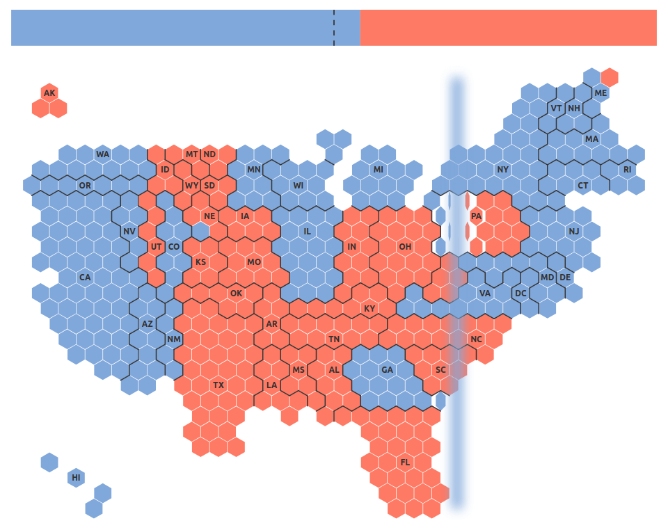

# Blue wave

A 7 second summary of the 2020 US presidential election

⚡️ Demo: [labs.karavia.ch/blue-wave/](https://labs.karavia.ch/blue-wave/)

[](https://labs.karavia.ch/blue-wave/)

## Build & Run

This project is based on [Svelte app template](https://github.com/sveltejs/template),
and can be built according to the following standard procedure.

Install the dependencies...

```bash
npm install
```

...then start [Rollup](https://rollupjs.org):

```bash
npm run dev
```

Navigate to [localhost:5000](http://localhost:5000). You should see your app running. Edit a component file in `src`, save it, and reload the page to see your changes.

## Production build

```bash
npm run build
```

## License

This project is licensed under the MPL 2.0 license, see the LICENSE file.
